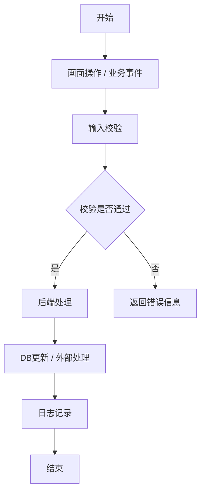

# 详细设计文档模板

Use this template to generate implementation-ready detailed design from one Feature Point.

## 1. 文档信息

| 项目 | 内容 |
|---|---|
| Feature Point ID | FP- |
| Feature Point Name |  |
| Product / System |  |
| Package / Module |  |
| 文档版本 | v0.1 |
| 作成日 |  |
| 作成者 |  |
| 输入资料 | 功能点输入表 / 要件定义 / 基本设计 |
| 状态 | Draft / Review / Confirmed |

## 2. 功能点输入整理

| 项目 | 内容 | 状态 |
|---|---|---|
| Business Purpose |  | 确认済 / 推定 |
| New Behavior |  | 确认済 / 推定 |
| Changed Behavior |  | 确认済 / 推定 / 未決 |
| Out of Scope |  | 确认済 / 推定 |

## 3. 既存影响分析

| Impact ID | 对象 | 名称 / 路径 / ID | 当前行为 | 影响分类 | 修改理由 | 回归范围 |
|---|---|---|---|---|---|---|
| IMP-FP-001-001 | 画面 / API / DB / 权限 / Job / 外部接口 |  |  | 追加 / 変更 / 流用 / 拡張 / 无影响 / 未确认 |  |  |

## 4. 最小修改方针

| No | 方针 | 说明 | 理由 | 风险 |
|---|---|---|---|---|
| STR-FP-001-001 | 配置 / 新增 / 拡張 / Wrapper / 既存変更 |  |  |  |

## 5. 处理流程详细设计

| Step | 执行者 | 处理 | 输入 | 输出 | 异常 | 关联设计 |
|---|---|---|---|---|---|---|
| 1 | 用户 / 系统 |  |  |  |  | DD-FP-001-001 |

## 6. 画面详细设计

| Screen ID | 画面名 | 新增 / 修改 | 目的 | URL / Route | 权限 | 备注 |
|---|---|---|---|---|---|---|
| SCR-FP-001-001 |  | 新增 / 修改 |  |  |  |  |

## 7. 画面项目定义

| Item ID | Screen ID | 项目名 | 类型 | 表示 / 输入 | 必须 | 初期值 | 校验 | 数据来源 / 保存先 |
|---|---|---|---|---|---|---|---|---|
| ITEM-FP-001-001 | SCR-FP-001-001 |  | Text / Select / Date / Table / Button | 表示 / 输入 | Yes / No |  | VAL-FP-001-001 | DB-FP-001-001 |

## 8. 画面迁移设计

| From | 操作 | 条件 | To | 参数 | 备注 |
|---|---|---|---|---|---|
| SCR-FP-001-001 |  |  | SCR-FP-001-002 |  |  |

## 9. API 详细设计

| API ID | 新增 / 修改 | Method | Path | 目的 | 调用元 | 权限 | 处理概要 |
|---|---|---|---|---|---|---|---|
| API-FP-001-001 | 新增 / 修改 | GET / POST / PUT / DELETE |  |  | SCR-FP-001-001 | PERM-FP-001-001 |  |

### 9.1 Request

| API ID | 参数 | 类型 | 必须 | 说明 | 校验 |
|---|---|---|---|---|---|
| API-FP-001-001 |  | string / number / boolean / object / array | Yes / No |  | VAL-FP-001-001 |

### 9.2 Response

| API ID | 字段 | 类型 | 说明 |
|---|---|---|---|
| API-FP-001-001 |  |  |  |

### 9.3 API 错误

| Error ID | API ID | 条件 | HTTP / Code | Message | 处理 |
|---|---|---|---|---|---|
| ERR-FP-001-001 | API-FP-001-001 |  | 400 / 403 / 404 / 409 / 500 |  |  |

## 10. 数据库详细设计

| DB ID | 新增 / 修改 | Table / Datastore | 目的 | 主键 | 备注 |
|---|---|---|---|---|---|
| DB-FP-001-001 | 新增 / 修改 |  |  |  |  |

### 10.1 字段定义

| DB ID | 字段名 | 类型 | 长度 | NULL | 默认值 | 索引 | 说明 |
|---|---|---|---|---|---|---|---|
| DB-FP-001-001 |  |  |  | Yes / No |  | Yes / No |  |

### 10.2 数据关系

| From | Relation | To | 说明 |
|---|---|---|---|
|  | 1:1 / 1:N / N:N |  |  |

## 11. 权限 / 角色 / 数据范围设计

| Permission ID | 角色 | 画面 | API | 操作 | 数据范围 | 控制方式 |
|---|---|---|---|---|---|---|
| PERM-FP-001-001 |  | SCR-FP-001-001 | API-FP-001-001 | 参照 / 登记 / 更新 / 删除 / 承认 | 全件 / 组织内 / 本人 | 前端 / 后端 / 平台设定 |

## 12. 校验 / 错误处理设计

| Validation ID | 对象 | 条件 | 错误消息 | 阻止处理 | 关联项目 |
|---|---|---|---|---|---|
| VAL-FP-001-001 | 画面 / API / DB |  |  | Yes / No | ITEM-FP-001-001 |

## 13. 日志 / 监查 / 运用设计

| Log ID | 对象 | 记录时机 | 记录内容 | 保存周期 | 用途 |
|---|---|---|---|---|---|
| LOG-FP-001-001 | API / 画面 / Job |  |  |  | 调查 / 监查 / 运用 |

## 14. 外部接口 / 文件 / 批处理 / 通知

| ID | 类型 | 新增 / 修改 | 对象 | 时机 | 数据 | 错误处理 |
|---|---|---|---|---|---|---|
| IF-FP-001-001 | 外部 API / CSV / 文件 / Job / 通知 | 新增 / 修改 |  |  |  |  |

## 15. 数据迁移 / 初期数据 / 兼容性

| No | 对象 | 处理内容 | 执行时机 | 回滚 | 备注 |
|---|---|---|---|---|---|
| MIG-FP-001-001 |  |  | 发布前 / 发布后 / 初回起动 |  |  |

## 16. 测试设计观点

| Test ID | 分类 | 测试观点 | 关联对象 | 期待结果 |
|---|---|---|---|---|
| TEST-FP-001-001 | 正常 / 异常 / 权限 / 回归 / 迁移 |  | SCR / API / DB / PERM |  |

## 17. 发布 / 回滚 / 影响确认

| No | 分类 | 内容 | 确认方法 | 担当 |
|---|---|---|---|---|
| REL-FP-001-001 | 发布 |  |  |  |
| RB-FP-001-001 | 回滚 |  |  |  |

## 18. 开发任务拆分

| Task ID | 分类 | 内容 | 依赖 | 完成条件 |
|---|---|---|---|---|
| TASK-FP-001-001 | Frontend / Backend / DB / Test / Release |  |  |  |

## 19. 未决事项与风险

| No | 内容 | 类型 | 影响 | 确认对象 | 优先度 |
|---|---|---|---|---|---|
| OPEN-FP-001-001 |  | 未決 / 推定 / 风险 | 范围 / 设计 / 测试 / 发布 | 客户 / PM / 架构 / 开发 | High / Medium / Low |

## 20. 追踪矩阵

| Feature Point ID | Design ID | Screen ID | API ID | DB ID | Permission ID | Test ID | Task ID |
|---|---|---|---|---|---|---|---|
| FP-001 | DD-FP-001-001 | SCR-FP-001-001 | API-FP-001-001 | DB-FP-001-001 | PERM-FP-001-001 | TEST-FP-001-001 | TASK-FP-001-001 |
